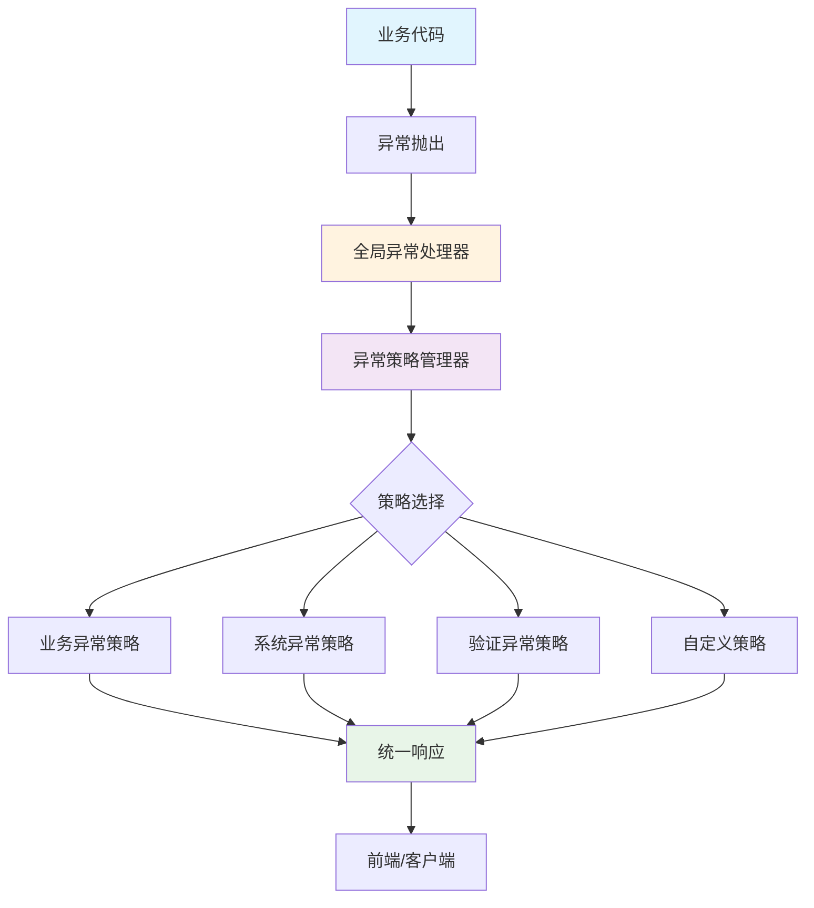

# 企业级异常体系架构设计

## 🎯 设计理念

### 核心原则
1. **统一性优先** - 一套体系解决所有异常处理需求
2. **开发体验至上** - 让开发者快速上手，降低学习成本
3. **架构可扩展** - 支持项目演进和业务增长
4. **多团队协作** - 统一的使用规范，减少沟通成本

### 设计哲学
> "异常处理不应该成为开发者的负担，而应该是项目的加速器"

## 🏗️ 架构设计

### 整体架构图



### 核心组件

#### 1. 异常层次结构（简洁设计）
```java
RuntimeException
└── BaseException (基础异常类)
    ├── BusinessException (业务异常)
    └── SystemException (系统异常)
```

**设计思路**：
- 只区分业务异常和系统异常，避免过度细分
- 业务异常：用户操作导致的可预期异常（如参数验证失败）
- 系统异常：技术层面的不可预期异常（如数据库连接失败）

#### 2. 策略模式的异常处理
```java
// 异常处理策略接口
public interface ExceptionHandlerStrategy {
    boolean supports(Exception exception);
    ExceptionHandlerResult handle(Exception exception);
    int getPriority();
}

// 策略管理器
@Component
public class ExceptionStrategyManager {
    // 自动发现和管理所有策略
    // 按优先级排序执行
}
```

**架构优势**：
- **可扩展性**：新增异常类型只需实现Strategy接口
- **职责分离**：每个策略专注处理特定类型异常
- **零配置**：Spring自动发现所有策略实现

#### 3. 统一的异常处理结果
```java
@Data
@Builder
public class ExceptionHandlerResult {
    private String errorCode;           // 错误码
    private String message;             // 用户友好消息
    private HttpStatus httpStatus;      // HTTP状态码
    private String traceId;            // 链路追踪ID
    private LogLevel logLevel;         // 日志级别
    // ... 其他字段
}
```

## 🚀 开发体验设计

### 1. 零学习成本的使用方式

#### 抛出异常（推荐方式）
```java
// 业务异常 - 简单直观
ExceptionUtils.throwBusiness(I18nCommonExceptionCode.DATA_NOT_FOUND);
ExceptionUtils.throwBusiness(I18nCommonExceptionCode.USER_ALREADY_EXISTS, username);

// 系统异常
ExceptionUtils.throwSystem(I18nCommonExceptionCode.DATABASE_ERROR, cause);

// 条件异常
ExceptionUtils.throwIf(user == null, I18nCommonExceptionCode.USER_NOT_FOUND);
```

#### 断言方式（更简洁）
```java
// 参数验证
Assert.notNull(request, "request");
Assert.notBlank(username, "username");
Assert.validEmail(email);

// 业务断言
Assert.exists(user);  // 等同于 throwIf(user == null, DATA_NOT_FOUND)
Assert.hasPermission(hasAccess);
```

### 2. 统一的响应格式

```json
{
  "code": 1001,
  "message": "数据不存在",
  "data": null,
  "timestamp": "2024-01-01T12:00:00",
  "traceId": "abc123def456"
}
```

### 3. 自动化的错误处理

开发者无需关心：
- 异常如何转换为HTTP响应
- 日志如何记录（自动根据异常类型选择日志级别）
- 国际化消息如何处理
- 链路追踪ID如何生成

## 🔧 扩展指南

### 添加自定义异常策略

```java
@Component
public class CustomExceptionStrategy implements ExceptionHandlerStrategy {
    
    @Override
    public boolean supports(Exception exception) {
        return exception instanceof CustomException;
    }
    
    @Override
    public ExceptionHandlerResult handle(Exception exception) {
        return ExceptionHandlerResult.builder()
                .errorCode("CUSTOM_001")
                .message("自定义异常处理")
                .httpStatus(HttpStatus.BAD_REQUEST)
                .build();
    }
    
    @Override
    public int getPriority() {
        return 1; // 高优先级
    }
}
```

### 添加新的异常码

```java
public enum BusinessExceptionCode implements I18nExceptionCode {
    ORDER_NOT_FOUND("2001", "exception.order_not_found", "订单不存在"),
    ORDER_STATUS_INVALID("2002", "exception.order_status_invalid", "订单状态无效");
    
    // 实现接口方法...
}
```

## 📊 监控和治理

### 1. 内置监控能力

- **链路追踪**：每个异常自动生成traceId
- **分类统计**：异常按类型、错误码自动分类
- **性能监控**：异常处理耗时监控

### 2. 日志标准化

```
异常处理 [abc123def456] - 路径: /api/users, 错误码: 1001, 消息: 用户不存在, 异常: BusinessException
```

### 3. 告警集成

- 系统异常自动记录ERROR日志，可接入告警系统
- 业务异常记录WARN日志，便于业务监控
- 支持自定义告警规则

## 🌟 最佳实践

### 1. 异常使用规范

```java
// ✅ 推荐：使用工具类
ExceptionUtils.throwBusiness(USER_NOT_FOUND);

// ✅ 推荐：带参数的异常
ExceptionUtils.throwValidation(PARAM_OUT_OF_RANGE, "age", "18", "65");

// ❌ 避免：直接throw new
throw new BusinessException(USER_NOT_FOUND);
```

### 2. 错误码设计规范

```java
// ✅ 语义化命名
USER_NOT_FOUND("1200", "exception.user_not_found", "用户不存在")

// ❌ 避免技术细节
DATABASE_CONNECTION_REFUSED("2000", "exception.db_error", "Connection refused: localhost:3306")
```

### 3. 多团队协作规范

- **统一异常码范围**：按模块分配错误码段
- **统一消息模板**：使用国际化资源文件
- **统一处理方式**：都使用ExceptionUtils工具类
- **统一监控标准**：traceId关联所有日志

## 💡 团队协作优势

### 1. 降低沟通成本
- 统一的异常处理方式，新人快速上手
- 标准化的错误响应格式，前后端协作简单
- 清晰的错误码分类，问题定位高效

### 2. 提升开发效率
- 零配置的异常处理，专注业务逻辑
- 自动化的日志记录，减少手动代码
- 丰富的工具方法，常用场景一行搞定

### 3. 保障系统稳定性
- 统一的异常处理入口，避免遗漏
- 自动的链路追踪，问题排查快速
- 分级的日志记录，监控告警精准

## 🎓 快速上手指南

### 5分钟入门

1. **第一步**：了解两种异常类型
   - BusinessException：业务相关异常
   - SystemException：系统相关异常

2. **第二步**：掌握异常抛出方式
   ```java
   ExceptionUtils.throwBusiness(异常码);
   Assert.notNull(对象, "参数名");
   ```

3. **第三步**：理解响应格式
   ```json
   {"code": 错误码, "message": "错误信息", "data": null}
   ```

4. **第四步**：查看日志追踪
   - 每个异常都有traceId
   - 可以通过traceId关联整个请求链路

### 进阶使用

- 添加自定义异常策略
- 扩展异常码枚举
- 集成监控告警系统

## 🔮 架构演进

这套异常体系设计支持：
- 微服务架构：每个服务使用相同的异常处理模式
- 多语言支持：完整的国际化方案
- 云原生部署：标准化的日志和监控
- 大团队协作：统一的规范和工具

通过这套架构，企业可以在保证系统稳定性的同时，大幅提升开发效率和团队协作效果。